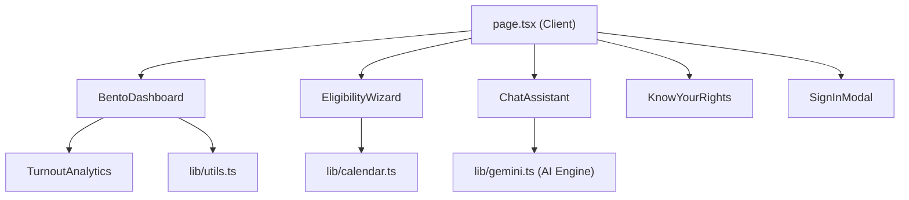

# DeshKaVote — Full Project Review

> **An Interactive Election Navigator for the World's Largest Democracy**  
> Built for International Conference Presentation

---

## Architecture Overview



---

## File Map

| File | Purpose | Lines |
|------|---------|-------|
| [page.tsx](file:///c:/Users/manju/OneDrive/Desktop/election-guide/election-guide/src/app/page.tsx) | Main layout — 70vw shell, header, sections, footer | ~60 |
| [layout.tsx](file:///c:/Users/manju/OneDrive/Desktop/election-guide/election-guide/src/app/layout.tsx) | Root layout with Geist fonts, SEO metadata, hydration fix | ~35 |
| [globals.css](file:///c:/Users/manju/OneDrive/Desktop/election-guide/election-guide/src/app/globals.css) | Tailwind v4 theme configuration | ~110 |
| [BentoDashboard.tsx](file:///c:/Users/manju/OneDrive/Desktop/election-guide/election-guide/src/components/BentoDashboard.tsx) | Animated bento-grid with live data, countdown, state info | ~250 |
| [EligibilityWizard.tsx](file:///c:/Users/manju/OneDrive/Desktop/election-guide/election-guide/src/components/EligibilityWizard.tsx) | 4-step voter profiling wizard with PIN validation | ~270 |
| [ChatAssistant.tsx](file:///c:/Users/manju/OneDrive/Desktop/election-guide/election-guide/src/components/ChatAssistant.tsx) | Floating AI chat with mobile bottom-sheet | ~130 |
| [KnowYourRights.tsx](file:///c:/Users/manju/OneDrive/Desktop/election-guide/election-guide/src/components/KnowYourRights.tsx) | Animated legal modal (Article 326, NOTA, Rule 42, 49-O) | ~100 |
| [SignInModal.tsx](file:///c:/Users/manju/OneDrive/Desktop/election-guide/election-guide/src/components/SignInModal.tsx) | Simulated Aadhaar OTP / e-Pramaan auth flow | ~140 |
| [TurnoutAnalytics.tsx](file:///c:/Users/manju/OneDrive/Desktop/election-guide/election-guide/src/components/TurnoutAnalytics.tsx) | Recharts area chart — historical ECI turnout data | ~70 |
| [gemini.ts](file:///c:/Users/manju/OneDrive/Desktop/election-guide/election-guide/src/lib/gemini.ts) | AI response engine with 15+ topic branches | ~90 |
| [calendar.ts](file:///c:/Users/manju/OneDrive/Desktop/election-guide/election-guide/src/lib/calendar.ts) | Google Calendar `.ics` link generator | ~20 |
| [utils.ts](file:///c:/Users/manju/OneDrive/Desktop/election-guide/election-guide/src/lib/utils.ts) | `cn()` helper (clsx + tailwind-merge) | ~6 |

---

## Feature Breakdown

### 1. Bento Dashboard (Hero Section)

- **"Live Pulse" Data Card**: Dark slate card with animated gradient blobs, showing real ECI stats (968M+ voters, 1.05M+ polling stations, 5.5M+ EVMs).
- **Next Election Countdown**: Live-ticking countdown to the next Lok Sabha election (May 2029) — uses `setInterval` with SSR-safe `isMounted` guard.
- **Voter Action Hub**: Quick-action links directly to official ECI portals (Form 6, Electoral Roll Search, e-EPIC Download).
- **State Directorate Widget**: Dropdown selects a state → dynamically renders the CEO name, toll-free number, email, and an animated turnout progress bar.
- **Turnout Analytics Chart**: `recharts` AreaChart showing 5 general elections (2004–2024) with Total vs Female turnout, gradient fills, and custom tooltips.

### 2. Eligibility Wizard

- **Step 1**: Choose voter type (New, Existing, Shifting, NRI) — each card has unique icon and description.
- **Step 2**: Select from all 37 Indian States & Union Territories.
- **Step 3**: PIN code entry with **validation** — maps the first digit of the PIN to the correct Indian postal zone for the selected state (e.g., `5xxxxx` for Karnataka, `1xxxxx` for Delhi). Rejects mismatches with a clear error message.
- **Step 4**: **Different procedural output per voter type**:
  - **New Voter**: Gather Documents → Apply Form 6 online → BLO Verification
  - **Shifting Voter**: Submit Form 8 → Upload new address proof
  - **Existing/NRI**: Check Electoral Roll → Locate polling booth → Calendar reminder

### 3. AI Chat Assistant

- Floating bot icon (bottom-right) opens a Claude-style chat panel.
- Mobile-responsive: bottom-sheet on small screens, floating card on desktop.
- **15+ topic branches** covering:
  - Taking children/phones into the booth
  - PwD/blind voter accessibility (Saksham App, Braille EVMs)
  - Paid leave rights (Section 135B)
  - Missing names on Electoral Roll
  - Form 6, Form 8, Form 6A procedures
  - NOTA, EVM/VVPAT, KYC App, polling booth SMS lookup
  - Intelligent fallback recommending 1950 helpline

### 4. Know Your Rights (Legal Modal)

- Framer Motion `AnimatePresence` for smooth open/close animations.
- Closes on backdrop click, close button, or Escape key equivalent.
- Four legally accurate sections:
  - **Article 326**: Universal adult suffrage
  - **NOTA**: Supreme Court ruling
  - **Rule 42**: Tendered Ballot Paper (bogus voting protection)
  - **Rule 49-O**: Right to refuse voting after sign-in

### 5. Sign-In Simulation

- **3-state flow**: Options → Loading spinner → Success checkmark
- Two authentication methods shown: Aadhaar OTP and EPIC/Voter Helpline Link
- On success: header transitions to show a "Logged In Citizen" profile badge with a logout button
- Fully animated with Framer Motion spring transitions

---

## Tech Stack

| Category | Technology |
|----------|-----------|
| Framework | Next.js 16.2.4 (App Router, Turbopack) |
| Language | TypeScript |
| Styling | Tailwind CSS v4 |
| Animations | Framer Motion |
| Charts | Recharts |
| Icons | Lucide React |
| Utilities | clsx, tailwind-merge, date-fns |
| Fonts | Geist Sans, Geist Mono (via next/font) |

---

## Data Accuracy

> [!IMPORTANT]
> All data displayed is sourced from publicly available ECI records and constitutional references.

| Data Point | Source | Value Used |
|-----------|--------|-----------|
| Total registered voters | ECI 2024 report | 968+ Million |
| Polling stations | ECI 2024 report | 1.05 Million+ |
| EVMs deployed | ECI 2024 report | 5.5 Million+ |
| 2024 General Election turnout | ECI official results | 65.79% |
| 2019 General Election turnout | ECI official results | 67.40% |
| 2014 General Election turnout | ECI official results | 66.44% |
| Female turnout trends | ECI gender-wise data | Rising parity since 2014 |
| Article 326 | Constitution of India | Universal adult suffrage |
| Rule 42 | Conduct of Elections Rules, 1961 | Tendered ballot procedure |
| Section 135B | RP Act, 1951 | Paid leave for polling day |

---

## Known Limitations

> [!NOTE]
> These are intentional trade-offs for the demo/conference scope.

- **Sign-In is simulated** — No real Aadhaar or e-Pramaan backend. Clearly labelled as simulation for the time being.
- **AI is pattern-matched** — Not connected to a real LLM. In production, this would use Vertex AI (Gemini).
- **PIN validation is zone-level** — Maps first digit to postal zone, not to individual PIN codes. A production version would use the India Post API.
- **State CEO names** — Only 5 major states are included in the dropdown; others fall back to "General Enquiry / 1950".

---

## Git Status

All changes have been committed to `main`:

```
[main eae31ad] feat: DeshKaVote v2 - Bento dashboard, AI assistant, Sign-In, Analytics, KnowYourRights, EligibilityWizard
 13 files changed, 1515 insertions(+), 307 deletions(-)
```

You can now safely retry the worktree merge.
